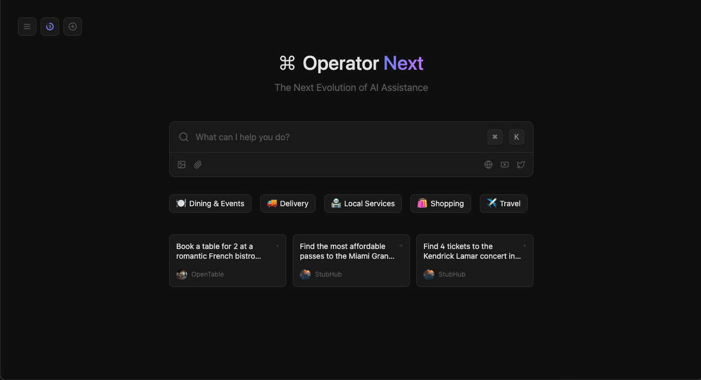
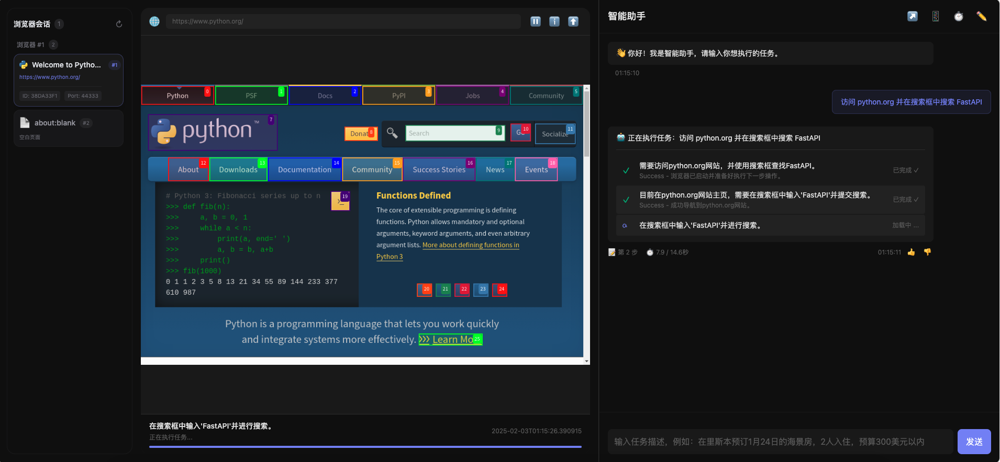

# OperatorNext 🤖

<div align="center">


[](https://github.com/OperatorNext/OperatorNext/blob/main/LICENSE)
[](https://github.com/OperatorNext/OperatorNext/stargazers)
[](https://github.com/OperatorNext/OperatorNext/issues)
[](https://github.com/OperatorNext/OperatorNext/pulls)
[](https://github.com/OperatorNext/OperatorNext/actions)

[English](./README.md) | [简体中文](./README.zh-CN.md)

---

**智能浏览器自动化平台**

*将自然语言转化为智能浏览器操作*

[快速开始](#-快速开始) • [项目文档](https://github.com/OperatorNext/OperatorNext/tree/main/docs) • [使用示例](#-使用示例) • [参与贡献](#-贡献指南)

</div>

OperatorNext 是一个基于 AI 的智能浏览器操作平台，它能够通过自然语言理解和执行复杂的浏览器任务。通过结合最新的 LLM 技术和浏览器自动化，我们为开发者和用户提供了一个强大的工具，能够轻松实现网页自动化、数据采集、UI 测试等多种场景的应用。

*主界面展示:*


*运行时截图展示任务执行:*


> ⚠️ **项目状态**
>
> 本项目目前处于早期开发阶段，核心功能正在积极开发中，尚未实现。
> 
> 请注意，在此阶段可能会频繁发生破坏性更改。

## ✨ 特性

- 🤖 **智能任务执行** - 通过自然语言描述即可完成复杂的浏览器操作
- 🔄 **实时状态反馈** - WebSocket 实时推送任务执行状态和进度
- 🎯 **精确控制** - 支持精确的 DOM 操作和复杂的交互场景
- 📊 **性能监控** - 内置系统资源监控，实时掌握任务执行情况
- 🔒 **安全可靠** - 完善的错误处理和异常恢复机制
- 🌐 **中文优化** - 完整的中文交互体验和错误提示

## 🚀 快速开始

### 环境要求

- Docker & Docker Compose
- Node.js 18+
- pnpm 10+
- Chrome/Chromium 浏览器

### 安装

1. 克隆仓库

```bash
git clone https://github.com/OperatorNext/OperatorNext.git
cd OperatorNext
```

2. 复制环境变量模板

```bash
# 复制前端环境变量
cp frontend/.env.local.example frontend/.env.local

# 复制 Docker 环境变量
cp .env.example .env
```

3. 安装前端依赖

```bash
cd frontend
pnpm install
```

4. 初始化数据库并生成类型

```bash
# 推送数据库架构
pnpm db:push

# 生成 Prisma 客户端和类型
pnpm db:generate
```

### 启动服务

1. 启动 Docker 服务

```bash
docker-compose up -d
```

这将启动以下服务：

| 服务 | 地址 | 描述 |
|---------|-----|-------------|
| Web 应用 | http://localhost:3000 | Next.js 前端应用 |
| PgAdmin | http://localhost:5051 | PostgreSQL 数据库管理 |
| Maildev | http://localhost:8026 | 邮件测试界面 |
| MinIO 控制台 | http://localhost:9003 | 对象存储管理 |
| MinIO API | http://localhost:9002 | S3 兼容 API 端点 |
| PostgreSQL | localhost:5438 | 数据库（通过 psql 或 GUI 连接） |

### 默认凭据

> ⚠️ 这些是开发环境凭据，请勿在生产环境中使用！

- **PostgreSQL**:
  - 用户名：operatornext_prod_user
  - 数据库：operatornext_production

- **PgAdmin**:
  - 邮箱：admin@operatornext.dev
  - 密码：见 `.env`