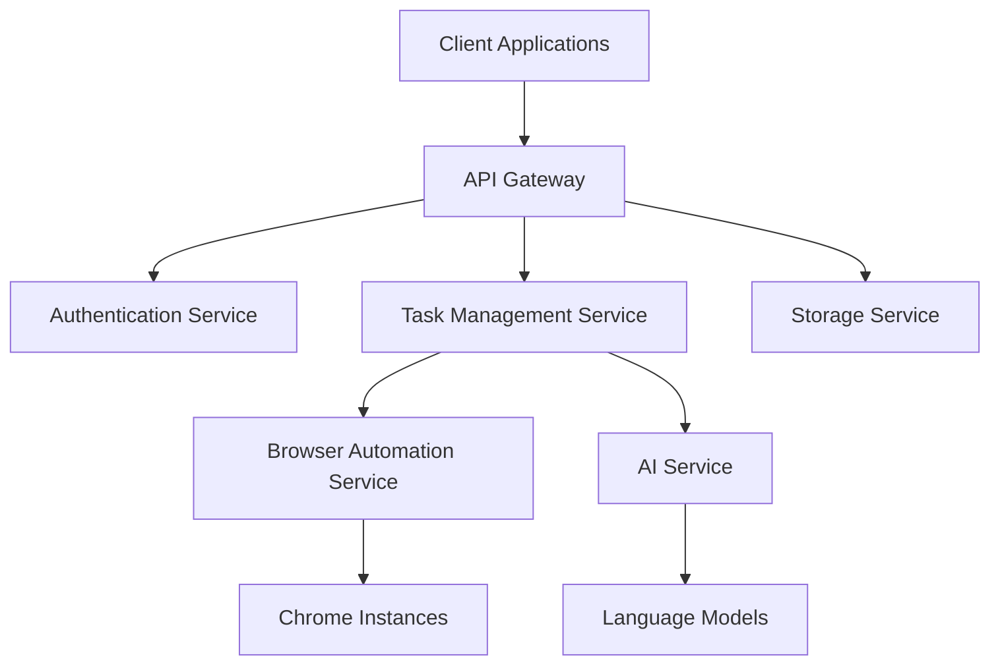
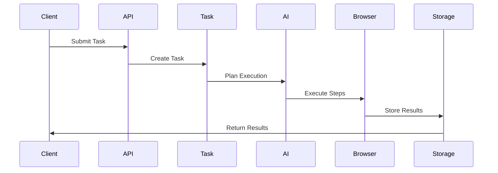
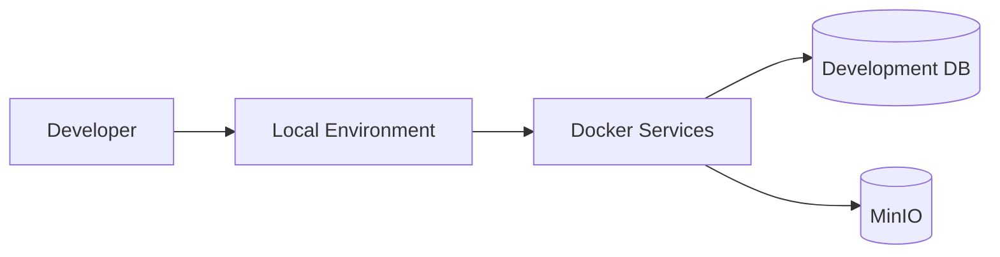
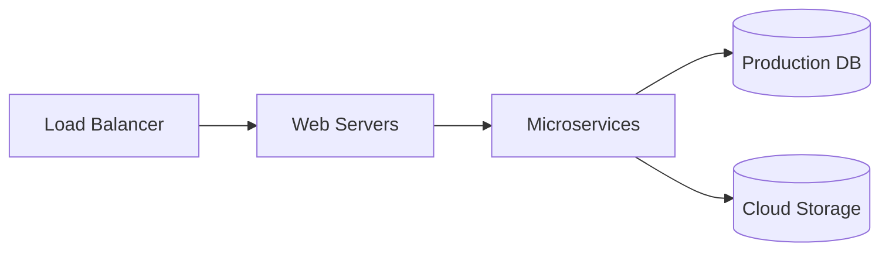

# Architecture Overview

This document provides a comprehensive overview of the OperatorNext architecture, including its components, design principles, and technical decisions.

## System Architecture

### High-Level Overview



## Core Components

### Frontend Architecture

The frontend is built as a monorepo using modern web technologies:

```
frontend/
├── apps/
│   └── web/              # Next.js application
│       ├── app/          # App router pages
│       ├── components/   # React components
│       └── lib/          # Utilities
├── packages/
│   ├── ui/              # Shared UI components
│   ├── api/             # API client
│   ├── auth/            # Authentication
│   └── config/          # Configuration
```

Key features:
- Next.js 15 with App Router
- React Server Components
- TypeScript for type safety
- Tailwind CSS for styling
- WebSocket for real-time updates

### Backend Architecture

The backend is designed with a modular, service-oriented architecture:

```
backend/
├── api/                 # API endpoints
├── core/               # Core business logic
├── services/           # Service implementations
├── models/             # Data models
└── utils/              # Utilities
```

Key features:
- FastAPI for high performance
- PostgreSQL for data storage
- Redis for caching
- MinIO for object storage
- WebSocket for real-time communication

## Service Descriptions

### Authentication Service

Handles user authentication and authorization:
- OAuth integration (GitHub, Google)
- JWT token management
- Role-based access control
- Session management

### Task Management Service

Manages browser automation tasks:
- Task queuing and scheduling
- Status tracking
- Resource allocation
- Error handling

### Browser Automation Service

Controls browser instances:
- Chrome management
- Parallel execution
- Resource monitoring
- Error recovery

### AI Service

Integrates with language models:
- Task planning
- Natural language processing
- Visual understanding
- Error correction

### Storage Service

Manages file storage:
- S3-compatible interface
- File upload/download
- Access control
- Bucket management

## Data Flow

### Task Execution Flow

1. Client submits task
2. Task service validates request
3. AI service plans execution
4. Browser service executes steps
5. Results are stored and returned



## Security Architecture

### Authentication Flow

1. User authentication
2. Token generation
3. Permission validation
4. Resource access

### Data Security

- End-to-end encryption
- Secure credential storage
- Access logging
- Regular security audits

## Scalability

### Horizontal Scaling

- Stateless services
- Load balancing
- Service discovery
- Container orchestration

### Vertical Scaling

- Resource optimization
- Performance monitoring
- Capacity planning
- Cache optimization

## Deployment Architecture

### Development Environment



### Production Environment



## Technology Stack

### Frontend Technologies
- Next.js 15
- React 19
- TypeScript 5.3
- Tailwind CSS 3.4
- Shadcn UI

### Backend Technologies
- FastAPI
- PostgreSQL
- Redis
- MinIO
- WebSocket

### Development Tools
- pnpm
- Docker
- GitHub Actions
- ESLint & Prettier

## Performance Considerations

### Optimization Strategies

1. **Caching**
   - Redis for data caching
   - Static asset caching
   - Query result caching

2. **Database**
   - Connection pooling
   - Query optimization
   - Index management

3. **Frontend**
   - Code splitting
   - Image optimization
   - Bundle size reduction

## Monitoring and Logging

### System Monitoring

- Resource utilization
- Service health
- Performance metrics
- Error tracking

### Application Logging

- Structured logging
- Log aggregation
- Error reporting
- Audit trails

## Future Considerations

### Planned Improvements

1. **Scalability**
   - Kubernetes deployment
   - Service mesh integration
   - Global distribution

2. **Features**
   - Advanced AI capabilities
   - Enhanced automation
   - Additional integrations

3. **Performance**
   - Edge computing
   - Enhanced caching
   - Optimized resource usage

## Additional Resources

- [API Documentation](../api/reference.md)
- [Deployment Guide](../deployment/index.md)
- [Security Guidelines](../deployment/security.md)
- [Development Guide](../guides/development.md) 