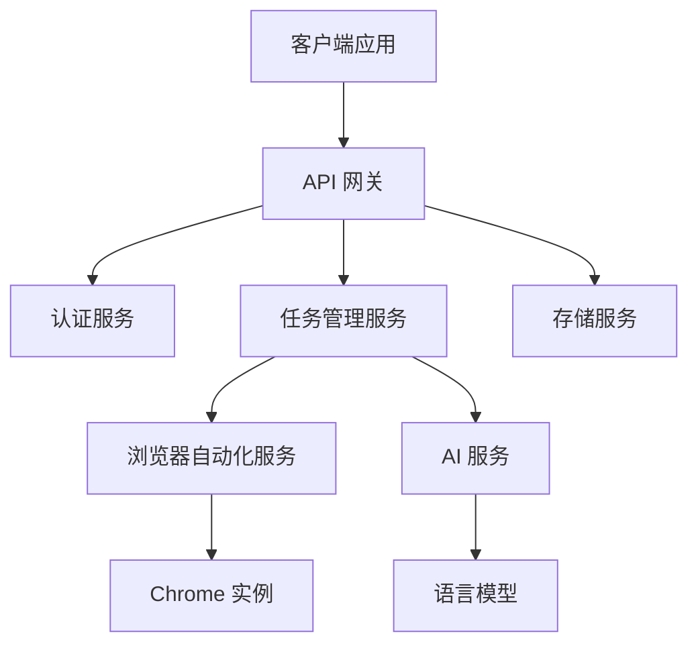
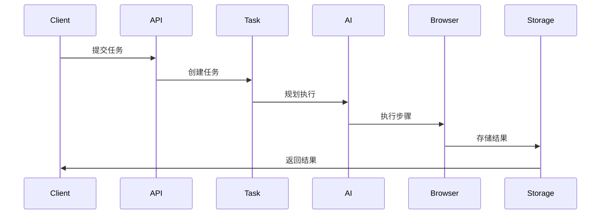
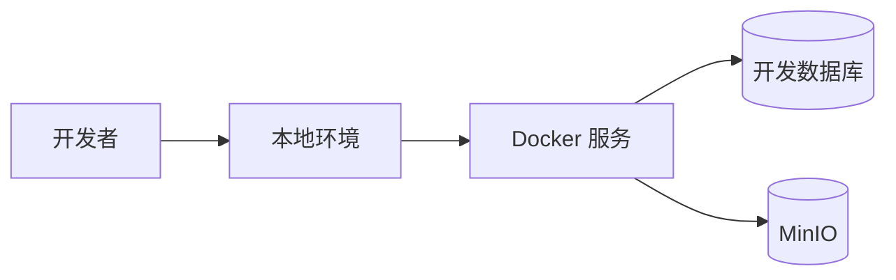
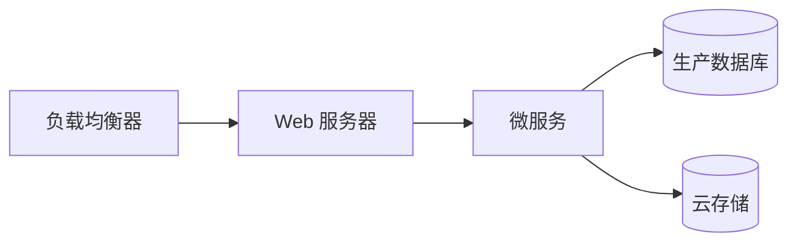

# 架构概览

本文档提供了 OperatorNext 架构的全面概述，包括其组件、设计原则和技术决策。

## 系统架构

### 高层概览



## 核心组件

### 前端架构

前端使用现代 Web 技术构建为单仓库：

```
frontend/
├── apps/
│   └── web/              # Next.js 应用
│       ├── app/          # App Router 页面
│       ├── components/   # React 组件
│       └── lib/          # 工具函数
├── packages/
│   ├── ui/              # 共享 UI 组件
│   ├── api/             # API 客户端
│   ├── auth/            # 认证
│   └── config/          # 配置
```

主要特性：
- 基于 App Router 的 Next.js 15
- React 服务器组件
- TypeScript 类型安全
- Tailwind CSS 样式
- WebSocket 实时更新

### 后端架构

后端采用模块化、面向服务的架构设计：

```
backend/
├── api/                 # API 端点
├── core/               # 核心业务逻辑
├── services/           # 服务实现
├── models/             # 数据模型
└── utils/              # 工具函数
```

主要特性：
- FastAPI 高性能框架
- PostgreSQL 数据存储
- Redis 缓存
- MinIO 对象存储
- WebSocket 实时通信

## 服务描述

### 认证服务

处理用户认证和授权：
- OAuth 集成（GitHub、Google）
- JWT 令牌管理
- 基于角色的访问控制
- 会话管理

### 任务管理服务

管理浏览器自动化任务：
- 任务队列和调度
- 状态追踪
- 资源分配
- 错误处理

### 浏览器自动化服务

控制浏览器实例：
- Chrome 管理
- 并行执行
- 资源监控
- 错误恢复

### AI 服务

集成语言模型：
- 任务规划
- 自然语言处理
- 视觉理解
- 错误纠正

### 存储服务

管理文件存储：
- S3 兼容接口
- 文件上传/下载
- 访问控制
- 存储桶管理

## 数据流

### 任务执行流程

1. 客户端提交任务
2. 任务服务验证请求
3. AI 服务规划执行
4. 浏览器服务执行步骤
5. 存储并返回结果



## 安全架构

### 认证流程

1. 用户认证
2. 令牌生成
3. 权限验证
4. 资源访问

### 数据安全

- 端到端加密
- 安全凭据存储
- 访问日志
- 定期安全审计

## 可扩展性

### 水平扩展

- 无状态服务
- 负载均衡
- 服务发现
- 容器编排

### 垂直扩展

- 资源优化
- 性能监控
- 容量规划
- 缓存优化

## 部署架构

### 开发环境



### 生产环境



## 技术栈

### 前端技术
- Next.js 15
- React 19
- TypeScript 5.3
- Tailwind CSS 3.4
- Shadcn UI

### 后端技术
- FastAPI
- PostgreSQL
- Redis
- MinIO
- WebSocket

### 开发工具
- pnpm
- Docker
- GitHub Actions
- ESLint & Prettier

## 性能考虑

### 优化策略

1. **缓存**
   - Redis 数据缓存
   - 静态资源缓存
   - 查询结果缓存

2. **数据库**
   - 连接池
   - 查询优化
   - 索引管理

3. **前端**
   - 代码分割
   - 图片优化
   - 包大小减少

## 监控和日志

### 系统监控

- 资源利用率
- 服务健康状况
- 性能指标
- 错误追踪

### 应用日志

- 结构化日志
- 日志聚合
- 错误报告
- 审计跟踪

## 未来考虑

### 计划改进

1. **可扩展性**
   - Kubernetes 部署
   - 服务网格集成
   - 全球分布

2. **功能**
   - 高级 AI 能力
   - 增强自动化
   - 额外集成

3. **性能**
   - 边缘计算
   - 增强缓存
   - 优化资源使用

## 其他资源

- [API 文档](../api/reference.md)
- [部署指南](../deployment/index.md)
- [安全指南](../deployment/security.md)
- [开发指南](../guides/development.md) 